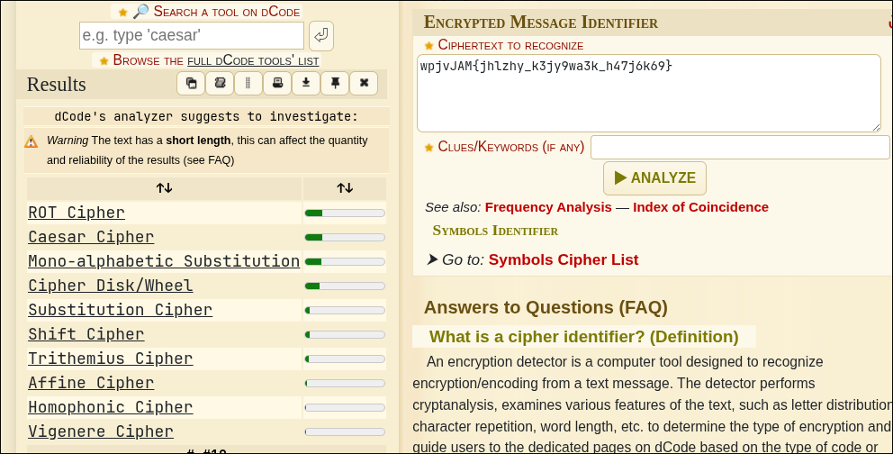

# WriteUp - interendec
## Overview

* **Name:** interendec
* **Category:** Cryptography
* **Point:** -
* **Level:** Easy
* **Author:** NGIRIMANA Schadrack
* **Year:** 2024
* **Desc:** Can you get the real meaning from this file.
* **File:** [enc_flag](./enc_flag)
* **Hint:** Engaging in various decoding processes is of utmost importance

## Summary

* 2x Base64 and Caesar Cipher

## Attack Idea


As we can see, the file contain "==" which this is often used in base64. <br>

Bring your dcoder, I curently using [Decodify](https://github.com/s0md3v/Decodify). Because this tools can be use on terminal. So it's easy to use.

````
  ls
󰡯 enc_flag
  dcode wpjvJAM{jhlzhy_k3jy9wa3k_h47j6k69}

              __                         __
            |/  |                   | / /
            |   | ___  ___  ___  ___|  (
            |   )|___)|    |   )|   )| |___ \   )
            |__/ |__  |__  |__/ |__/ | |     \_/
                                              /
            https://github.com/s0md3v/Decodify
  dcode YidkM0JxZGtwQlRYdHFhR3g2YUhsZmF6TnFlVGwzWVROclgyZzBOMm8yYXpZNWZRPT0nCg==

              __                         __
            |/  |                   | / /
            |   | ___  ___  ___  ___|  (
            |   )|___)|    |   )|   )| |___ \   )
            |__/ |__  |__  |__/ |__/ | |     \_/
                                              /
            https://github.com/s0md3v/Decodify
[+] Decoded from Base64: b'd3BqdkpBTXtqaGx6aHlfazNqeTl3YTNrX2g0N2o2azY5fQ=='

  dcode d3BqdkpBTXtqaGx6aHlfazNqeTl3YTNrX2g0N2o2azY5fQ==

              __                         __
            |/  |                   | / /
            |   | ___  ___  ___  ___|  (
            |   )|___)|    |   )|   )| |___ \   )
            |__/ |__  |__  |__/ |__/ | |     \_/
                                              /
            https://github.com/s0md3v/Decodify
[+] Decoded from Base64: wpjvJAM{jhlzhy_k3jy9wa3k_h47j6k69}
````

wpjvJAM{jhlzhy_k3jy9wa3k_h47j6k69} -> this is kind of a substitution cipher, we can use dcode identifier to identify the cipher.

> 

then, we can check each by each what a chiper is, by clicking and decrypt using
``ROT Cipher	
Caesar Cipher	
Mono-alphabetic Substitution	
Cipher Disk/Wheel	
Substitution Cipher	
Shift Cipher	
Trithemius Cipher	
Affine Cipher	
Homophonic Cipher	
Vigenere Cipher
``

prioritize the top one.

then you got the flag.

emm..

I make the code to solve this one btw.

[caesar_decrypt.py](./caesar_decrypt.py)
````
  python caesar_decrypt.py
Input Caesar Cipher: wpjvJAM{jhlzhy_k3jy9wa3k_h47j6k69}
0 wpjvJAM{jhlzhy_k3jy9wa3k_h47j6k69}
1 voiuIZL{igkygx_j3ix9vz3j_g47i6j69}
2 unhtHYK{hfjxfw_i3hw9uy3i_f47h6i69}
3 tmgsGXJ{geiwev_h3gv9tx3h_e47g6h69}
4 slfrFWI{fdhvdu_g3fu9sw3g_d47f6g69}
5 rkeqEVH{ecguct_f3et9rv3f_c47e6f69}
6 qjdpDUG{dbftbs_e3ds9qu3e_b47d6e69}
7 picoCTF{caesar_d3cr9pt3d_a47c6d69} -> this is the flag
8 ohbnBSE{bzdrzq_c3bq9os3c_z47b6c69}
9 ngamARD{aycqyp_b3ap9nr3b_y47a6b69}
10 mfzlZQC{zxbpxo_a3zo9mq3a_x47z6a69}
11 leykYPB{ywaown_z3yn9lp3z_w47y6z69}
12 kdxjXOA{xvznvm_y3xm9ko3y_v47x6y69}
13 jcwiWNZ{wuymul_x3wl9jn3x_u47w6x69}
14 ibvhVMY{vtxltk_w3vk9im3w_t47v6w69}
15 haugULX{uswksj_v3uj9hl3v_s47u6v69}
16 gztfTKW{trvjri_u3ti9gk3u_r47t6u69}
17 fyseSJV{squiqh_t3sh9fj3t_q47s6t69}
18 exrdRIU{rpthpg_s3rg9ei3s_p47r6s69}
19 dwqcQHT{qosgof_r3qf9dh3r_o47q6r69}
20 cvpbPGS{pnrfne_q3pe9cg3q_n47p6q69}
21 buoaOFR{omqemd_p3od9bf3p_m47o6p69}
22 atnzNEQ{nlpdlc_o3nc9ae3o_l47n6o69}
23 zsmyMDP{mkockb_n3mb9zd3n_k47m6n69}
24 yrlxLCO{ljnbja_m3la9yc3m_j47l6m69}
25 xqkwKBN{kimaiz_l3kz9xb3l_i47k6l69}
None
````

<b>FLAG:
----

 picoCTF{caesar_d3cr9pt3d_a47c6d69} 
 </b>
