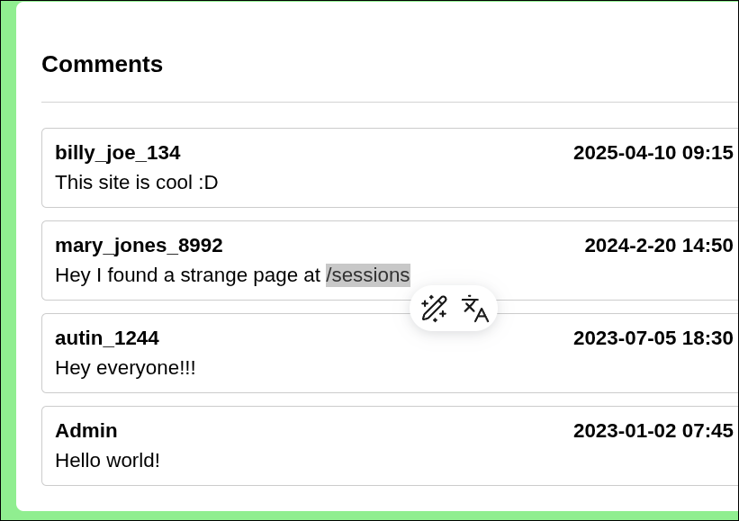
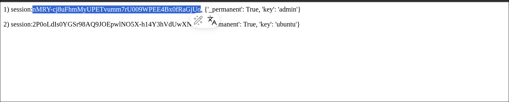

# WriteUp - Old Sessions

## Overview

* **Name:** Old Sessions
* **Category:** Web Exploitation
* **Point:** 100
* **Author:** David Gaviria
* **Year:** 2026
* **Desc:** 
````
Proper session timeout controls are critical for securing user accounts. If a user logs in on a public or shared computer but doesn’t explicitly log out (instead simply closing the browser tab), and session expiration dates are misconfigured, the session may remain active indefinitely.

This then allows an attacker using the same browser later to access the user’s account without needing credentials, exploiting the fact that sessions never expire and remain authenticated.

Your friend tells you to check out a new social media platform he built a few years ago. Although its still under development, he said the site is almost complete. He also mentioned that he hates constantly logging into sites, and so has made his page that 'once you login, you never have to log-out again'!
````
* **Attachment:** http://dolphin-cove.picoctf.net:54711/
* **Hint:** 
1. Do you know how to use the web inspector?
2. Where are cookies stored?

## Summary

* Exposed Cookies in /sessions directory

## Attack Idea

registered as normal user.
>


the cookies that exposed:
>

using cookies editor to store the admin cookie that we got.
> 

<b>FLAG:
----
picoCTF{s3t_s3ss10n_3xp1rat10n5_51c526ab}
 </b>
