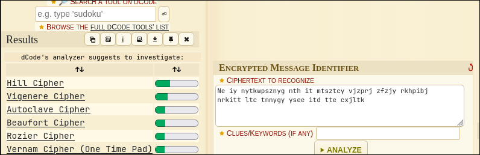
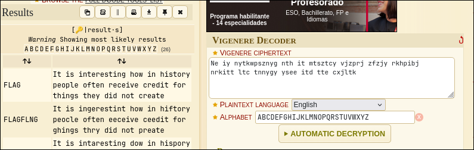
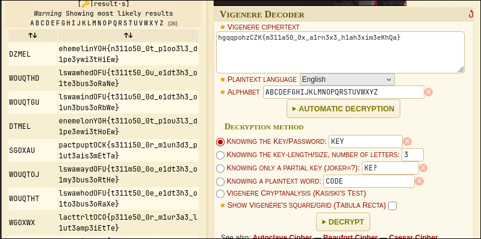
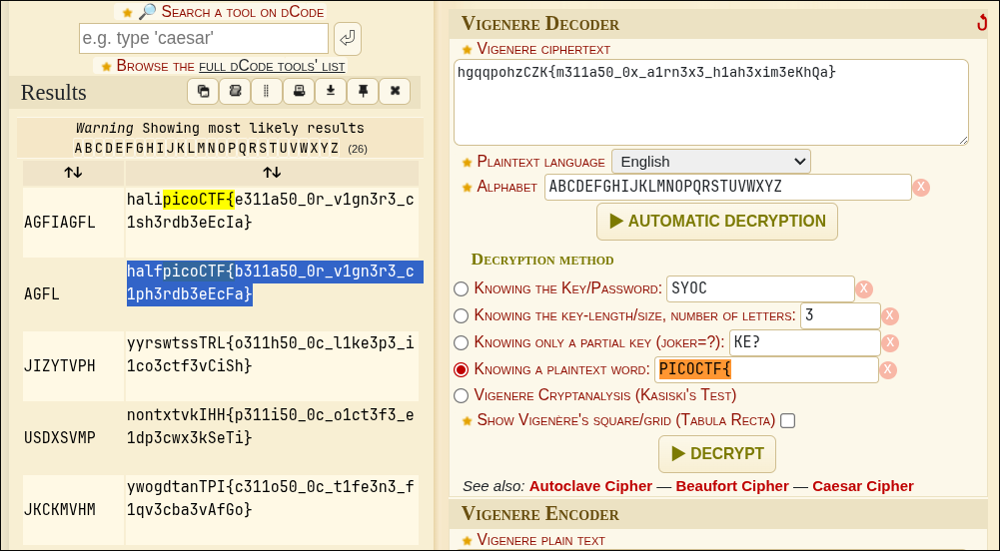

# WriteUp - la cifra de

## Overview

* **Name:** la cifra de
* **Category:** Cryptography
* **Point:** 200
* **Author:** Alex Fulton/Daniel Tunitis
* **Year:** 2019
* **Desc:** I found this cipher in an old book.
* **Attachment2:** nc fickle-tempest.picoctf.net 55351.
* **Hint:** 
- There are tools that make this easy.
- Perhaps looking at history will help

## Summary

* Vignere cipher

## Attack Idea

While start connect to the _netcat_ I got this message:
````
Ne iy nytkwpsznyg nth it mtsztcy vjzprj zfzjy rkhpibj nrkitt ltc tnnygy ysee itd tte cxjltk

Ifrosr tnj noawde uk siyyzre, yse Bnretèwp Cousex mls hjpn xjtnbjytki xatd eisjd

Iz bls lfwskqj azycihzeej yz Brftsk ip Volpnèxj ls oy hay tcimnyarqj dkxnrogpd os 1553 my Mnzvgs Mazytszf Merqlsu ny hox moup Wa inqrg ipl. Ynr. Gotgat Gltzndtg Gplrfdo

Ltc tnj tmvqpmkseaznzn uk ehox nivmpr g ylbrj ts ltcmki my yqtdosr tnj wocjc hgqq ol fy oxitngwj arusahje fuw ln guaaxjytrd catizm tzxbkw zf vqlckx hizm ceyupcz yz tnj fpvjc hgqqpohzCZK{m311a50_0x_a1rn3x3_h1ah3xim3eKhQa}

Zmp fowdt cjwl-jtnusjytki oeyhcivytot tq a vtwygqahggptoh nivmpr nthebjc, wgx xajj lruzyd 1467 hd Weus Mazytszf Llhjcto.

Yse Bnretèwp Cousex nd tnjceltce ytxeznxey hllrjo tnj Llhjcto Itsi tc Argprzn Nivmpr.

Os 1508, Uonfynkx Eroysesnfs osgetypd zmp su-hllrjo tggflg wpczf (l mgycid tq snnqtki llvmlbkyd) tnfe wuzwd rfeex gp a iwttohll itxpuspnz tq tnj Gimjyèrk Htpnjc.

Bkqwayt’d skhznj gzoqqpt guaegwpd os 1555 ls g hznznyugytot tq tnj qixxe. Tnj wocjc hgqgey tq tnj llvmlbkyd axj yoc xsilypd xjrurfcle, gft zmp arusahjes gso tnj tnjji lkyeexx lrk rtxki my sjlny tq a sspmustc qjj pnwlsk, bsiim nat gp dokqexjyt cneh kfnh itcrkxaotipnz.
````

Then I select first sentence to analyze with [dcode.fr](https://www.dcode.fr/cipher-identifier)
```
Ne iy nytkwpsznyg nth it mtsztcy vjzprj zfzjy rkhpibj nrkitt ltc tnnygy ysee itd tte cxjltk
```
 

Choose that seems possible.



then we got 'em.

Let we do for the suspicious word one.
```
hgqqpohzCZK{m311a50_0x_a1rn3x3_h1ah3xim3eKhQa}
```



since the flag not appear, we can use **"KNOWING A PLAINTEXT WORD"**.


We got the flag then....

use ctrl + f for find somthing in the page. like the text who got blue color.

<b>FLAG:
----

picoCTF{b311a50_0r_v1gn3r3_c1ph3rdb3eEcFa}
 </b>
