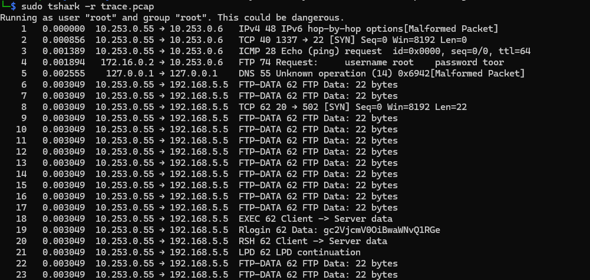
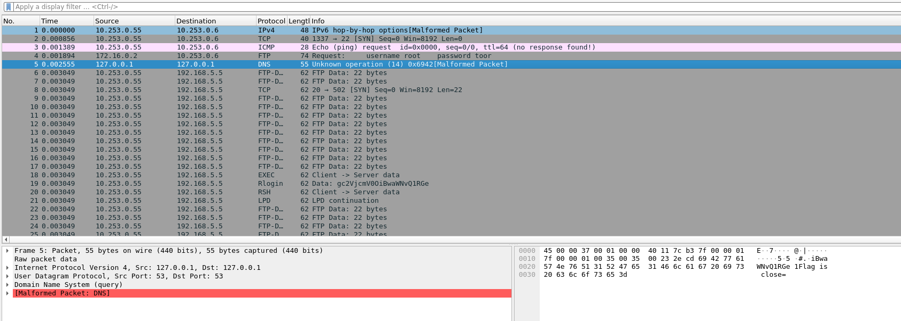
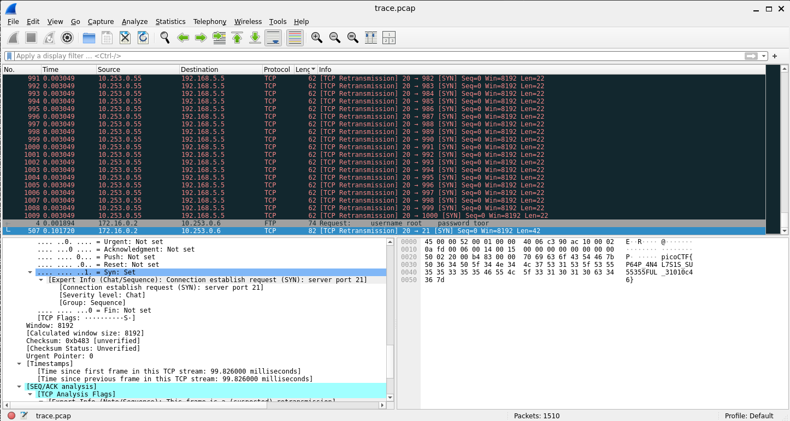

# WriteUp - PcapPoisoning

## Overview

* **Name:** PcapPoisoning
* **Category:** Forensic
* **Point:** 100
* **Level:** Medium
* **Author:** Mubarak Mikail
* **Year:** 2023
* **Desc:** How about some hide and seek heh?
* **File:** [file](./trace.pcap)
* **Hint:** -

## Summary

* someone has came to the system without permission.

## Analysis Idea

1. using tshark to see smething diffrent.
>

there it is.<br>
 **0x6942[Malformed Packet]** why the packet malformed ? <br>
...

and yup, after you have noted some suspicious things, now we use wireshark to know what it is.

````bash
    5   0.002555    127.0.0.1 → 127.0.0.1    DNS 55 Unknown operation (14) 0x6942[Malformed Packet]
   19   0.003049  10.253.0.55 → 192.168.5.5  Rlogin 62 Data: gc2VjcmV0OiBwaWNvQ1RGe
   30   0.003049  10.253.0.55 → 192.168.5.5  NCP 62 Unknown type (0x4f69)
   54   0.003049  10.253.0.55 → 192.168.5.5  DSI 62 Unknown flag (0x67) Unknown function (0x63) (12886)
  180   0.003049  10.253.0.55 → 192.168.5.5  ACAP 62 Request: gc2VjcmV0OiBwaWNvQ1RGe
  379   0.003049  10.253.0.55 → 192.168.5.5  RSYNC 62 Client Initialisation (Version OiBwaWNvQ1RGe) -> : picoCTF
  508   0.000856  10.253.0.55 → 10.253.0.6   TCP 40 1337 → 22 [ACK] Seq=4294966308 Ack=1 Win=8192 Len=0

````

````
 504   0.003049  10.253.0.55 → 192.168.5.5  FTP-DATA 62 FTP Data: 22 bytes
  505   0.003049  10.253.0.55 → 192.168.5.5  FTP-DATA 62 FTP Data: 22 bytes
  506   0.003049  10.253.0.55 → 192.168.5.5  FTP-DATA 62 FTP Data: 22 bytes
  507   0.101720   172.16.0.2 → 10.253.0.6   TCP 82 [TCP Retransmission] 20 → 21 [SYN] Seq=0 Win=8192 Len=42 -> who is 172.162.0.2?
  508   0.000856  10.253.0.55 → 10.253.0.6   TCP 40 1337 → 22 [ACK] Seq=4294966308 Ack=1 Win=8192 Len=0
  509   0.003049  10.253.0.55 → 192.168.5.5  TCP 62 [TCP Retransmission] 20 → 500 [SYN] Seq=0 Win=8192 Len=22
  510   0.003049  10.253.0.55 → 192.168.5.5  TCP 62 [TCP Retransmission] 20 → 501 [SYN] Seq=0 Win=8192 Len=22
  511   0.003049  10.253.0.55 → 192.168.5.5  TCP 62 [TCP Retransmission] 20 → 502 [SYN] Seq=0 Win=8192 Len=22
  512   0.003049  10.253.0.55 → 192.168.5.5  TCP 62 [TCP Retransmission] 20 → 503 [SYN] Seq=0 Win=8192 Len=22
````
> 

we git initial clue, so we must keep thorough forward

we got the flag at 172.16.0.2 Retransmission.
 


<b>

## Flags
---
picoCTF{P64P_4N4L7S1S_SU55355FUL_31010c46}
</b>
FLAG_VALUE
