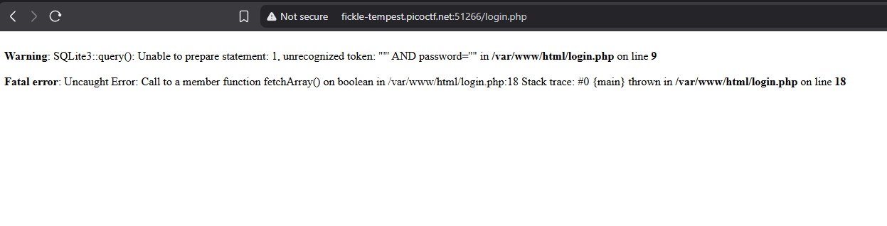
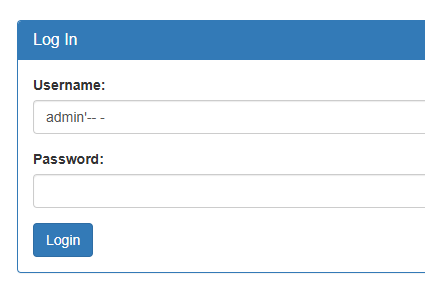
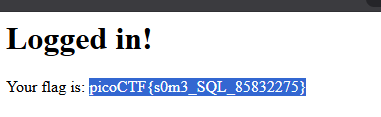

# WriteUp - Irish-Name-Repo 1

## Overview

* **Name:** Irish-Name-Repo 1
* **Category:** Web Exploitation 
* **Point:** 300
* **Level:** Medium
* **Author:** Chris Hensler
* **Year:** 2019
* **Desc:** Do you think you can log us in? Try to see if you can login!
* **Attachment:** http://fickle-tempest.picoctf.net:57531/
* **Hint:** HINT
1. There doesn't seem to be many ways to interact with this. I wonder if the users are kept in a database?
2. Try to think about how the website verifies your login.

## Summary

* SQLi using comment

## Attack Idea

Try to input ` if you see a login page, this will help you to identify what types of vulnurable on the website.

> 

with this error message, we know the SQL query and from this we can provide correct payload.
 `` "username='' AND password=''"``

lets do with this simple payload ``admin'-- -``. So what's the payload do ? 
 -- - = comment in SQL, seems like python ``#``
 So, what ever text after ``--`` its will be ignored as well.

> 
> 

<b>

## Flags
---
picoCTF{s0m3_SQL_85832275}
</b>
