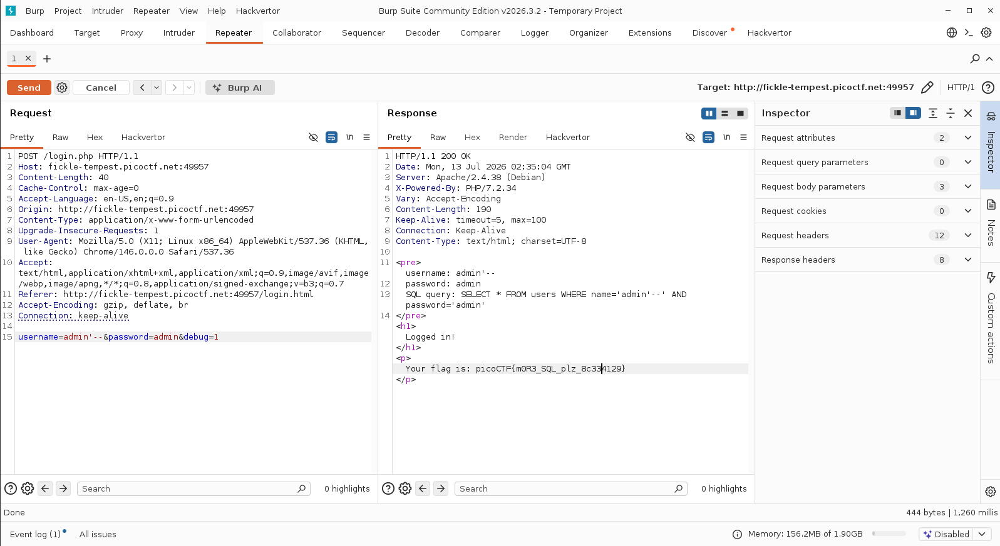

# WriteUp - Irish-Name-Repo 2

## Overview

* **Name:** Irish-Name-Repo 2
* **Category:** Web Exploitation
* **Level:** 350
* **Author:** Xingyang Pan
* **Year:** 2019
* **Desc:** Someone has bypassed the login before, and now it's being strengthened. Try to see if you can still login!
* **Attachment:** http://fickle-tempest.picoctf.net:4995/
* **Hint:** the password is being filtered

## Summary

* Just filtered by debug=0 

## Attack Idea

So the website do debug=0 that hide error message from user/ hacker. So in the burpsuite we manipulate the debug to debug=1

 

<b>

## Flags
---
picoCTF{m0R3_SQL_plz_8c334129}
</b>
