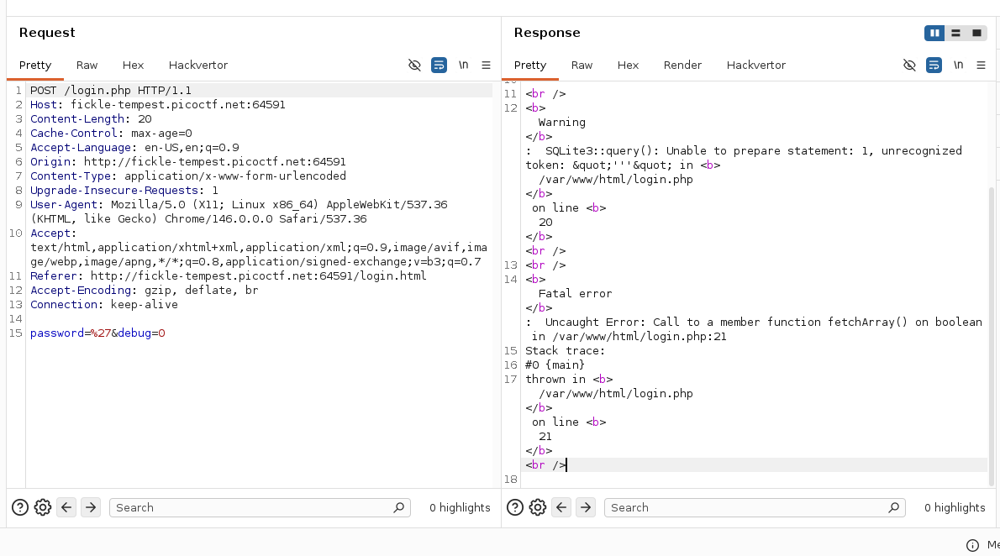
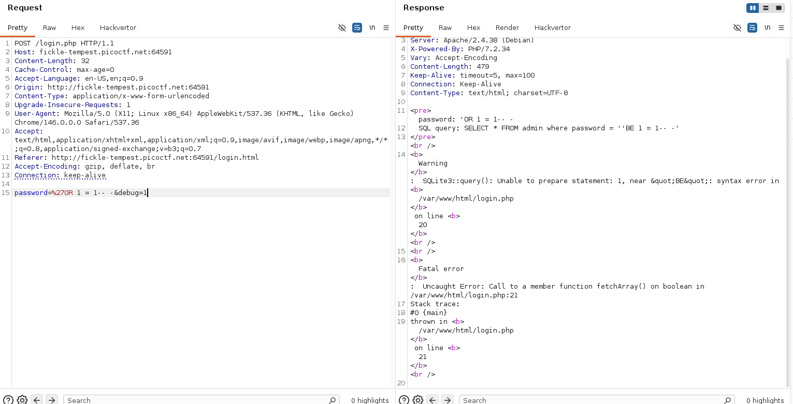
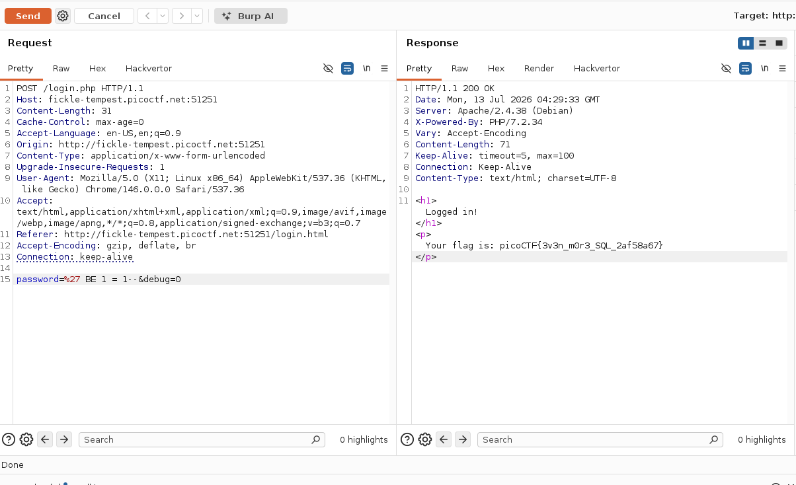

# WriteUp -Irish-Name-Repo 3

## Overview

* **Name:**  Irish-Name-Repo 3
* **Category:** 
* **Point:** 400
* **Level:** Medium
* **Author:** Xingyang Pan
* **Year:** 2019
* **Desc:** Try to see if you can login as admin!
* **Attachment:** http://fickle-tempest.picoctf.net:64591/
* **Hint:** Seems like the password is encrypted.

## Summary

* SQLI with caesar cipher(shift 13) encrypted

## Attack Idea

1. Verify if the web server vuln by SQLI, using ipnut " ' "  
 

2. Then try to do some SQLI
> 

give debug=1 so we can see clearly the error message. 
as we can see the payload `` 'OR 1 = 1-- -``, reads by the web server to ``'BE 1 = 1-- -``

this is a encryption, especialy **Caesar Cipher** enc, you can analyze in this website: dcode.fr/cipher-identifier

next is, make the server reads the true payload ``'OR 1 = 1-- -'`` with send **Casar Cipher** text: ``'BE 1 = 1-- -``

3. Sent caesar cipher with shift 13
>  

<b>

## Flags
---
picoCTF{3v3n_m0r3_SQL_2af58a67}
</b>
