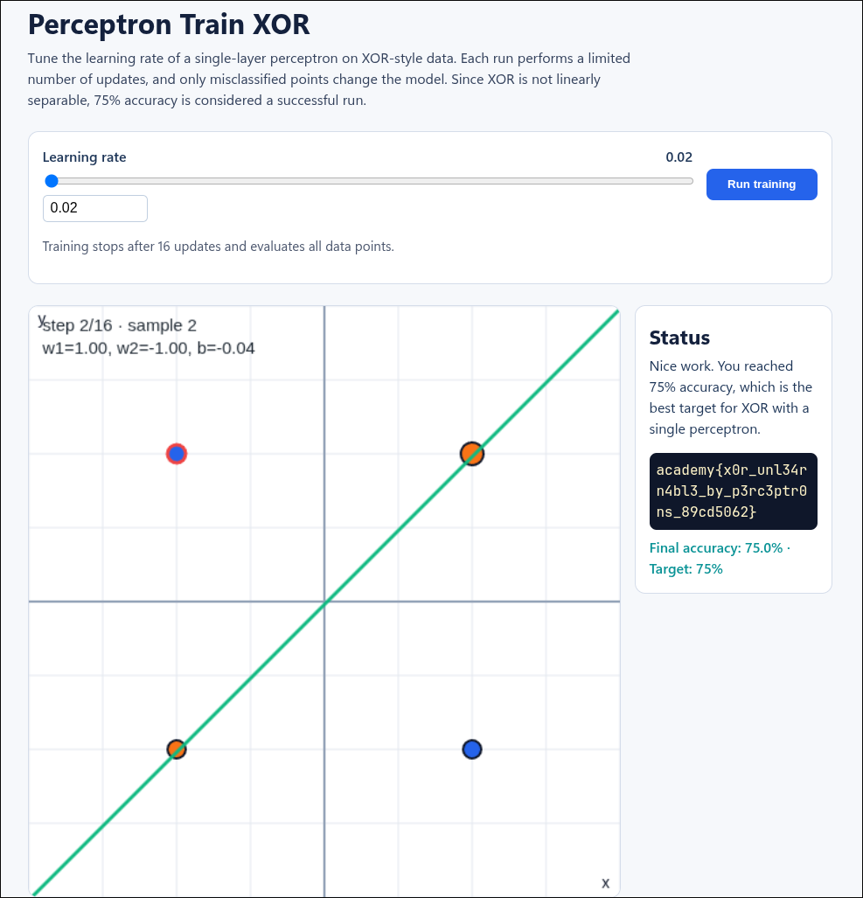

# Writeup CyberLab - Perceptron Train XOR

* **Title: Perceptron Train XOR**
* **Category: Artificial Intelligence**
* **Level: Easy**
* **Author: LT 'syreal' Jones**
* **Desc: "Watch a perceptron learn in real time on XOR data using the classic update rule: only misclassified points trigger updates, with no weight decay. Because XOR is not linearly separable, a single perceptron cannot hit 100% accuracy. Reach 75% accuracy to prove you understand the limitation and reveal the flag."**

## Summary
>  

I just got the flag  by click the button "Learning Rate"  
So, whatever the Learning Rate the result will got 75%.  
It means the application return the flag.

<b> FLAG
---
academy{x0r_unl34rn4bl3_by_p3rc3ptr0ns_89cd5062}

